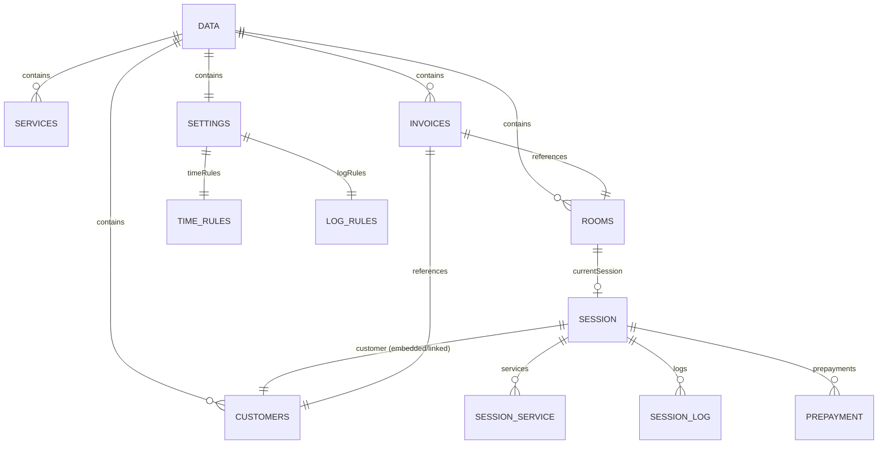
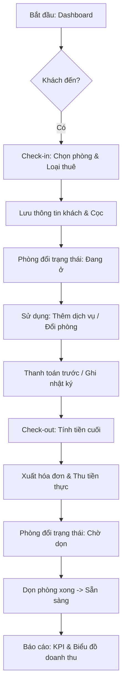

   dùng Tailwind CSS và Lucide React cho nhẹ và đẹp nhé.    
Dưới đây là bản “báo cáo kiến trúc” chi tiết bằng tiếng Việt cho bản QLKS hiện tại.

## 1. Sơ đồ “Database” & cấu trúc dữ liệu

App không dùng DB server trực tiếp mà dùng một “gói dữ liệu” JSON duy nhất, được tải qua API hoặc file `data.json` và cache vào `localStorage` thông qua `StorageService` (`js/core/StorageService.js:1`).

### 1.1. Đối tượng gốc `data`

`StorageService.getData()` trả về một object có khung:

- `rooms: []`
- `services: []`
- `customers: []`
- `invoices: []`
- `settings: {}`
- `lastUpdated: string | null`

Nguồn: `js/core/StorageService.js:1-4`.

Có thể xem đây là các “bảng” chính:

- Bảng `rooms`
- Bảng `services`
- Bảng `customers`
- Bảng `invoices`
- Bảng `settings`
- (Thêm vài “bảng phụ” lưu trong `localStorage` riêng: `users`, `authUser`, `auditLogs`…)

---

### 1.2. Bảng `rooms` – Phòng & trạng thái

Phần lớn schema phòng được tạo/ghi tại:

- `RoomController.saveRoom()` – `js/controllers/RoomController.js:83-100`
- `SettingsController.saveNewRoom()` – `js/controllers/SettingsController.js:168-176`

Cấu trúc một phòng:

- `id: number` – thường là `Date.now()`.
- `name: string` – số phòng, ví dụ “101”.
- `area: string` – khu vực / tầng (ví dụ “Tầng 1”) (`js/controllers/RoomController.js:85,91`).
- `type: string` – loại phòng, ví dụ “Standard” (`RoomController`), hoặc từ `roomTypes` (`SettingsController`).
- `enableOvernight: boolean` – bật/tắt chế độ giá qua đêm (`js/controllers/RoomController.js:92`).
- `prices: { hourly, nextHour, overnight, daily }`:
  - `hourly: number` – giá giờ đầu (`RoomController.js:94,60`).
  - `nextHour: number` – giá giờ tiếp (`RoomController.js:95,61`).
  - `overnight: number` – giá qua đêm (`RoomController.js:96,62`).
  - `daily: number` – giá ngày (`RoomController.js:97,63`).
- `status: string` – một trong:
  - `'available' | 'hourly' | 'daily' | 'dirty' | 'repair'`  
    Sử dụng trong Dashboard và các modal trạng thái (`RoomController.js:143-148`, `Dashboard.js:82-83,120-123`).
- `currentSession` hoặc `currentGuest`:
  - Là object “phiên thuê phòng” hiện tại (xem mục 1.3).
- Có thể có thêm:
  - `roomTypes` (từ settings) được dùng để gợi ý type khi tạo phòng mới (`SettingsController.js:145-176`).

---

### 1.3. Đối tượng `session` – Phiên thuê phòng

Phiên được tạo khi nhận phòng tại:

- `CheckInController.submit()` – `js/controllers/CheckInController.js:468-525`.

Cấu trúc cơ bản:

- `customer: {...}` – object khách hàng nhúng trực tiếp:
  - Tối thiểu: `id, name, phone, idCard` (`CheckInController.js:487-496`).
- `checkInTime: string` – ISO datetime khi nhận phòng (`CheckInController.js:513`).
- `type: 'hourly' | 'daily' | 'overnight'` – loại thuê (`CheckInController.js:514`, `currentRentalType` chọn ở UI `CheckInController.js:16-21, 120-130`).
- `price: number` – giá phòng đang áp dụng cho loại này, có thể đã được sửa tay (`CheckInController.js:515`).
- `nextHour: number` – giá giờ tiếp theo (fallback từ `room.prices.nextHour || room.prices.hourly`) (`CheckInController.js:516`).
- `deposit: number` – tiền cọc hiện tại (`CheckInController.js:517`).
- `services: Array<{ id, name, price, qty }>` – dịch vụ đã chọn lúc check-in (`CheckInController.js:315-321, 518`).
- `note: string` – ghi chú phòng (`CheckInController.js:227,519`).
- `logs: Array<{ time, action, user }>` – nhật ký hành động trên phiên phòng, khởi tạo với log “Nhận phòng” (`CheckInController.js:520-524`, ghi thêm bằng `logActivity` tại `js/core/Utils.js:62-67`).
- Các trường nâng cao được thêm trong folio nâng cấp:
  - `roomChargeLocked: number` – phần tiền phòng đã chốt trước đó, cộng dồn vào lần tính sau (`js/folio_upgrade.js:1144-1147`).
  - `prepayments: Array<{ id, amount, time, method, note }>` – lịch sử thanh toán trước (`js/folio_upgrade.js:691-698`, `709-729`).

---

### 1.4. Bảng `services` – Dịch vụ & kho

Tạo/sửa dịch vụ tại:

- `ServiceController.saveService()` – `js/controllers/ServiceController.js:179-207`.

Cấu trúc dịch vụ:

- `id: number`
- `name: string` – tên món/dịch vụ.
- `unit: string` – đơn vị (chai, lon, lượt…) (`ServiceController.js:192-195`).
- `price: number` – đơn giá (`ServiceController.js:195`).
- `stock: number`:
  - `-1` nghĩa là “không quản lý kho” (dịch vụ vô hạn) (`ServiceController.js:193,196`, logic UI `getAutoIcon`/`toggleStockInput`).
- `icon: string` – mã icon FontAwesome (ví dụ `fa-coffee`) nếu người dùng cấu hình; nếu bỏ trống, hệ thống tự đoán dựa vào tên (`ServiceController.js:63-69`, `5-13`).

Trong `session.services`, chỉ một số trường được copy: `id, name, price, qty`.

---

### 1.5. Bảng `customers` – Khách hàng

Tạo/sửa thủ công:

- `CustomerController.saveCustomer()` – `js/controllers/CustomerController.js:93-104`.

Tạo/cập nhật tự động khi check-in:

- `CheckInController.submit()` – `js/controllers/CheckInController.js:481-505`.

Cấu trúc khách:

- Cơ bản (khi tạo trong CheckIn):

  - `id: number`
  - `name: string`
  - `phone: string`
  - `idCard: string`
  - `totalSpent: number`
  - `visits: number`
  - `lastVisit: string (ISO)`  
    Nguồn: `CheckInController.js:487-496`.

- Bổ sung khi quản lý trong Settings:

  - `plate: string` – biển số xe (`CustomerController.js:68-69, 98`).
  - `note: string` – ghi chú khách (`CustomerController.js:73-75, 98`).

- Ghi chú khách cũng được đồng bộ từ Folio (ghi chú khách trong hóa đơn phòng):

  - Cập nhật `session.customer.note` và `data.customers[*].note` nếu có id trùng (`FolioController.js:396-405`).

Tìm kiếm khách thông minh: dùng `removeDau` để bỏ dấu tiếng Việt và hỗ trợ tìm theo tên/điện thoại/biển số (`CustomerController.js:6-27`).

---

### 1.6. Bảng `invoices` – Hóa đơn doanh thu

Hóa đơn được tạo khi thanh toán trong bản folio nâng cấp:

- `js/folio_upgrade.js:1060-1071`.

Cấu trúc hóa đơn:

- `id: number` – thường `Date.now()`.
- `roomId: number`
- `roomName: string`
- `checkIn: string (ISO)`
- `checkOut: string (ISO)`
- `customerName: string`
- `roomCharge: number` – tiền phòng.
- `serviceCharge: number` – tiền dịch vụ.
- `serviceFee: number` – phí dịch vụ bổ sung (hiện để `0` làm chỗ trống mở rộng).
- `totalAmount: number` – tổng cộng.
- `deposit: number` – tổng tiền đã cọc.
- `finalCollection: number` – số thực thu (tổng trừ cọc) (`js/folio_upgrade.js:1066-1071`).

Đây là nguồn dữ liệu chính cho màn hình báo cáo:

- `ReportController.loadData()` – lấy `data.invoices` (`js/controllers/ReportController.js:18-26`).
- `ReportController.updateUI()` – tính KPI và render bảng (`js/controllers/ReportController.js:47-76`).
- `ReportController.renderChart()` – gom theo ngày để render biểu đồ Chart.js (`js/controllers/ReportController.js:190-229`).

---

### 1.7. Bảng `settings` – Cài đặt hệ thống

`settings` chứa nhiều nhánh con, quan trọng nhất là:

1. `settings.timeRules` – quy định giờ nhận/trả/phụ thu (dùng cho logic tính tiền ngày):

   - Được lưu tại `SettingsController.saveSettings()` – `js/controllers/SettingsController.js:120-135`.
   - Cấu trúc:
     - `checkIn: "HH:mm"`
     - `checkOut: "HH:mm"`
     - `overnight: { start: "HH:mm", end: "HH:mm" }`
     - `fullDayEarlyBefore: "HH:mm"`
     - `fullDayLateAfter: "HH:mm"`
     - `earlyRules: Array<{ from:"HH:mm", to:"HH:mm", percent:number }>`
     - `lateRules: Array<{ from:"HH:mm", to:"HH:mm", percent:number }>`  
       Phần UI hiển thị các rule: `js/pages/Settings_General.js:1-12, 62-105, 166-231`.

   - Logic tính tiền ngày sử dụng `timeRules.fullDayLateAfter` (xem mục 2.2.2).

2. `settings.logRules` – cấu hình loại hành động nào sẽ được ghi vào nhật ký phòng:

   - Default và UI: `js/pages/Settings_Reports.js:1-8, 89-110`.
   - Sử dụng khi lưu dịch vụ trong folio nâng cấp: `js/folio_upgrade.js:843-861`.

3. Một số cài đặt khác:

   - `settings.overnight_start: string "HH:mm"` – dùng để tự động chọn “Qua đêm” nếu khách đến sau giờ này (`js/controllers/CheckInController.js:117-130`).

---

### 1.8. Các “bảng phụ” lưu riêng trong `localStorage`

Ngoài `data`, bạn còn có:

1. `users` – danh sách tài khoản nhân viên:

   - Khởi tạo admin mặc định: `AuthController.ensureDefaultAdmin()` – `js/controllers/AuthController.js:1-19`.
   - Cấu trúc: `{ id, username, password, phone, role, permissions }` (`StaffController.create()` – `js/controllers/StaffController.js:212-224`).
   - `permissions` là object map từ mã quyền (ví dụ `'CHECKIN_OUT'`) sang `boolean`.

2. `authUser` – người dùng đang đăng nhập hiện tại:

   - Ghi tại `AuthController.login()` – `js/controllers/AuthController.js:29-38`.
   - Cấu trúc: `{ id, username, role, phone }`.

3. `auditLogs` – nhật ký audit (hiện đang dùng để log xóa hóa đơn):

   - Ghi tại `ReportController.deleteInvoice()` – `js/controllers/ReportController.js:172-183`.
   - Mỗi log có: `{ time, action, user }`.

---

## 2. Logic tính tiền (giờ, ngày, đêm, phụ thu) – Vị trí & Cách hoạt động

Hiện tại có ba “đời” logic giá phòng:

1. Module chung `RoomPriceLogic` dùng cho Dashboard & tổng kết.
2. Logic trong `FolioController` (bản folio cũ).
3. Logic trong `folio_upgrade.js` (bản folio nâng cấp, gắn với settings giờ).

### 2.1. Module chung `RoomPriceLogic` (logic mới, tổng quát)

File: `js/logic/RoomPriceLogic.js:1-59`.

#### 2.1.1. Hàm `calculate(session, data)`

- Đầu vào:
  - `session`: đối tượng phiên sử dụng phòng (mục 1.3).
  - `data`: dữ liệu hệ thống, dùng để tìm `nextHour` nếu thiếu.

- Các bước:

1. Tính thời lượng lưu trú:

   - Lấy `now = new Date()`.
   - Lấy `checkIn = new Date(session.checkInTime)`.
   - `diffMs = now - checkIn`.
   - `diffMins = floor(diffMs / 60000)` – số phút chênh lệch (`RoomPriceLogic.js:5-8`).

2. Khởi tạo:

   - `price = 0; note = ""`.

3. Case `session.type === 'hourly'` – Thuê theo giờ:

   - `hours = ceil(diffMins / 60)` – làm tròn lên theo giờ (`RoomPriceLogic.js:14-15`).
   - `firstHourPrice = session.price` – giá giờ đầu (đã chốt khi check-in).
   - Xác định `nextHourPrice`:

     - Ưu tiên `session.nextHour` nếu có (`RoomPriceLogic.js:18`).
     - Nếu không có mà có `data.rooms`, tìm room chứa session này:
       - `room.currentSession === session || room.currentGuest === session` (`RoomPriceLogic.js:19-22`).
       - Lấy `room.prices.nextHour` nếu tìm được.
     - Nếu cuối cùng vẫn không có, fallback = `firstHourPrice` (`RoomPriceLogic.js:24`).

   - Tính tiền:
     - Nếu `hours <= 1`: `price = firstHourPrice`, note = `"1 giờ đầu"` (`RoomPriceLogic.js:26-29`).
     - Nếu >1: `price = firstHourPrice + (hours-1)*nextHourPrice`, note = `"{hours} giờ"` (`RoomPriceLogic.js:30-32`).

4. Case `session.type === 'daily'` – Thuê theo ngày:

   - `days = max(1, ceil(diffMins / (24*60)))` – làm tròn lên theo ngày (`RoomPriceLogic.js:34-35`).
   - `price = days * session.price`.
   - `note = "{days} ngày"`.

5. Case `session.type === 'overnight'` – Qua đêm:

   - Đơn giản: `price = session.price; note = "Qua đêm"` (`RoomPriceLogic.js:37-39`).

6. Case khác (fallback):

   - `price = session.price || 0` (`RoomPriceLogic.js:41`).

7. Phí phòng đã chốt (`roomChargeLocked`):

   - Nếu session có `roomChargeLocked`, cộng thẳng vào `price` (`RoomPriceLogic.js:44-46`).

8. Trả về:

   - `{ price, note }`.

#### 2.1.2. Hàm `summarize(session, data)`

- File: `js/logic/RoomPriceLogic.js:51-59`.
- Công thức:

  - `roomPrice = calculate(session, data).price`.
  - `servicePrice = sum(s.price * s.qty)` với `s` trong `session.services`.
  - `totalCharge = roomPrice + servicePrice`.
  - `totalPrepaid = sum(p.amount)` với `p` trong `session.prepayments`.
  - `balance = totalCharge - totalPrepaid`.

- Trả về: `{ roomPrice, servicePrice, totalCharge, totalPrepaid, balance }`.

#### 2.1.3. Nơi sử dụng

- Dashboard: tính nhanh giá phòng hiện tại trên card phòng:
  - `js/pages/Dashboard.js:95-98`.
  - Nếu `window.RoomPriceLogic` tồn tại thì dùng `RoomPriceLogic.calculate(session, data)`; nếu không, fallback = `session.price`.

- Các tính năng nâng cấp khác có thể dùng để đồng bộ hóa giữa Folio và Dashboard.

---

### 2.2. Logic trong `folio_upgrade.js` – tính tiền gắn với cài đặt giờ ra (bản nâng cấp)

File: `js/folio_upgrade.js:1090-1148`.

Đây là bản logic phòng “nâng cấp” để sử dụng `settings.timeRules` (đặc biệt cho thuê theo ngày).

#### 2.2.1. Giao diện sử dụng

- Khi tính tiền phòng trong các thao tác:

  - Render Folio, cập nhật bill, prePay, confirmPrePay, checkout… nhiều chỗ gọi:
    - `const calcResult = RoomPriceLogic.calculate(session, data);`  
      Ví dụ: `js/folio_upgrade.js:611-614, 681-684, 882-889, 1053`.

- Đây là `RoomPriceLogic` nội bộ của `folio_upgrade.js`, không phải module chung.

#### 2.2.2. Hàm `RoomPriceLogic.calculate(session, data)` trong `folio_upgrade.js`

1. Bảo hiểm:

   - Nếu thiếu `session` hoặc `data` hoặc `data.settings`: trả `{ price:0, note:"" }` (`js/folio_upgrade.js:1091-1093`).

2. Chuẩn bị dữ liệu:

   - `checkIn = new Date(session.checkInTime)`.
   - `checkOut = new Date()` – tính theo thời điểm gọi.
   - `diffMinutes = floor((checkOut - checkIn)/60000)` (`1093-1095`).

3. Case `hourly` (theo giờ):

   - `totalHours = max(1, ceil(diffMinutes/60))` (`1099-1101`).
   - `finalRoomPrice = session.price + (totalHours - 1)*(session.nextHour || session.price)`:
     - Lấy giá giờ tiếp từ `session.nextHour` nếu có, nếu không dùng lại `session.price`.
   - `note = "Ở {totalHours} GIỜ"` (`1100-1102`).

4. Case `daily` (theo ngày) – đây là phần quan trọng vì gắn với `timeRules`:

   - Lấy `timeRules = data.settings.timeRules || {}` (`1104-1105`).
   - Khai báo:
     - `checkOutTime = timeRules.checkOut || "12:00"`.
     - `fullDayLateAfter = timeRules.fullDayLateAfter || "18:00"` (`1106-1107`).

   - Parse giờ:
     - `[checkOutHour, checkOutMinute] = checkOutTime.split(':')`.
     - `[lateHour, lateMinute] = fullDayLateAfter.split(':')` (`1109-1111`).

   - Tính “chuẩn” giờ trả phòng ngày hôm sau:
     - `standardCheckOut`: lấy ngày check-in, tăng thêm 1 ngày, set giờ phút = `checkOutTime` (`1113-1117`).

   - Tính ngưỡng tính thêm ngày (lateThreshold):

     - `lateAfterMinutes = (lateHour*60+lateMinute) - (checkOutHour*60+checkOutMinute)` (`1121`).
     - `lateThreshold = standardCheckOut + lateAfterMinutes` (`1120-1122`).

   - Xác định `dayCount`:

     - Bắt đầu từ 1 ngày (`1124-1125`).
     - Nếu `checkOut >= lateThreshold` → `dayCount += 1` (trả quá muộn sau ngưỡng thì tính thêm 1 ngày) (`1127-1129`).
     - Tính phần giờ vượt quá 24h:
       - `hoursOver = max(0, (diffMinutes - 1440)/60)` (`1132-1134`).
       - Nếu `hoursOver > 0` → `dayCount += floor(hoursOver/24)` (`1134-1136`).

   - Bảo hiểm `dayCount >= 1`.
   - `finalRoomPrice = dayCount * session.price`.
   - `note = "Ở {dayCount} NGÀY"` (`1138-1140`).

   => Như vậy đây là logic:

   - Ít nhất một ngày.
   - Ra sớm trước `fullDayLateAfter` thì không cộng ngày.
   - Ra sau `fullDayLateAfter` hoặc ở rất lâu thì tự cộng thêm ngày tương ứng.

5. Case `overnight` – qua đêm:

   - `finalRoomPrice = session.price` (`1141-1143`).

6. Phần tiền phòng đã khóa:

   - Nếu `session.roomChargeLocked` tồn tại:
     - `finalRoomPrice += session.roomChargeLocked` (`1144-1147`).

7. Trả về `{ price: finalRoomPrice, note }`.

#### 2.2.3. Liên quan phụ thu (phần trăm)

- UI đã có cấu hình `earlyRules`/`lateRules` và `fullDayEarlyBefore`/`fullDayLateAfter` (Settings_General, `js/pages/Settings_General.js:62-125,166-231`).
- Trong logic giá hiện tại, mới sử dụng `fullDayLateAfter` để quyết định có cộng thêm 1 ngày hay không.
- Các rule phần trăm `earlyRules` / `lateRules` chưa được áp dụng trực tiếp trong hàm tính tiền.  
  → Có thể coi là “cơ sở hạ tầng sẵn sàng”, để tương lai bạn bổ sung phụ thu % chi tiết.

---

### 2.3. Logic Folio cũ (`js/controllers/FolioController.js`)

File: `js/controllers/FolioController.js:549-568`.

- Đây là `RoomPriceLogic` đơn giản hơn:

  - Theo giờ:
    - `totalHours = max(1, ceil(diffMinutes/60))`.
    - `finalRoomPrice = session.price + (totalHours - 1)*(session.nextHour || session.price)` (`FolioController.js:558-560`).
    - `detail = "({totalHours} giờ)"`.
  - Theo ngày:
    - `dayCount = max(1, ceil(diffMinutes/1440))`, không dùng `timeRules` (`FolioController.js:563-565`).
    - `detail = "({dayCount} ngày x {session.price}đ)"`.
  - Cộng `roomChargeLocked` nếu có (`FolioController.js:567`).

- Hàm này chủ yếu dùng cho UI folio cũ để ghi chú công thức (`room-price-formula`) và tổng tiền hiện tại (`updateFolioBill` – `FolioController.js:275-308`).

---

### 2.4. Tiền dịch vụ, cọc và thanh toán trước

#### 2.4.1. Tính tổng dịch vụ

- Trong Folio nâng cấp:

  - `svcMoney = sum(s.price * s.qty)` với `s` trong `session.services`.
  - Dùng nhiều nơi, ví dụ: `js/folio_upgrade.js:613-614, 683-684, 1066-1068`.

- Trong Folio cũ:

  - `savedServices` và `tempServices` được tách riêng để hiển thị chênh lệch, highlight phần tăng/giảm (`FolioController.js:279-324, 331-362`).

#### 2.4.2. Tiền cọc & thanh toán trước

- Cọc ban đầu:

  - Nhập khi nhận phòng trên Check-in UI:
    - `ci-deposit` / `ci-deposit-display` (`CheckInController.js:214-223`).
  - Lưu vào `session.deposit` (`CheckInController.js:517`).

- Thanh toán trước (prepayment):

  - Mở dialog “Thanh toán trước” trong Folio nâng cấp: `FolioController.prePay(roomId)` (`js/folio_upgrade.js:601-663`).
  - Tính `balance = max(0, totalCharge - currentDeposit)` trước khi hiển thị (`js/folio_upgrade.js:611-616`).
  - Khi xác nhận:
    - Tính lại `balance`.
    - Giới hạn số tiền thanh toán không vượt `balance`: `finalAmount = min(amount, balance)` (`js/folio_upgrade.js:688-690`).
    - Ghi vào `session.prepayments`:
      - `{ id, amount, time, method, note }` (`js/folio_upgrade.js:691-698`).
    - Cộng vào `session.deposit` (`js/folio_upgrade.js:699`).
    - Ghi log chi tiết (`logActivity`) (`js/folio_upgrade.js:700-701`).
    - Cập nhật UI và lưu `data` (`js/folio_upgrade.js:703-706`).

- Lịch sử thanh toán trước:

  - `FolioController.showPrepayHistory(roomId)` hiển thị bảng các lần prepay trong modal (`js/folio_upgrade.js:709-761`).

- Kết toán cuối:

  - Trong folio nâng cấp, khi check-out:
    - Tạo hóa đơn với `roomCharge`, `serviceCharge`, `deposit`, `finalCollection = finalTotal - deposit` (`js/folio_upgrade.js:1060-1071`).
    - Xóa `currentSession`, set `status = 'available'` (`js/folio_upgrade.js:1080-1082`).

---

## 3. Các tính năng đặc biệt bạn đã xây dựng

Dựa trên code, có thể tóm lại những “tâm huyết” nổi bật như sau:

### 3.1. UI Check-in & Folio theo chuẩn Apple, cực chăm chút mobile

- `CheckInController.open(room)` – `js/controllers/CheckInController.js:108-268`:
  - Modal full-screen dạng mobile, bo góc lớn, font Roboto, anti-aliased.
  - Header giống app iOS: nút “Hủy”, tiêu đề “Phòng X”, nút menu trạng thái.
  - Segmented control cho loại thuê (theo giờ / ngày / qua đêm) với slider màu chạy mượt (`CheckInController.js:179-197`).
  - Card tài chính rõ ràng: giá phòng, cọc, ghi chú, auto format tiền (`CheckInController.js:200-227`).
  - Card dịch vụ dạng scroll ngang, badge số lượng ngay trên icon (`CheckInController.js:230-245`).
  - Footer cố định với “Tổng tạm tính” và nút “Nhận phòng ngay” (`CheckInController.js:248-257`).

- Folio mới:

  - `FolioController.renderFolioHTML(room, session, data)` – `js/controllers/FolioController.js:89-259`:
    - Card tổng phải thu màu gradient, hiển thị tên khách, thời lượng ở, expand xem chi tiết công thức tiền phòng, tiền dịch vụ, cọc, ghi chú khách & phòng.
    - Catalog dịch vụ ngang có drag-scroll mượt (tự viết hàm `enableDragScroll`) (`FolioController.js:51-87, 228-237, 450-452`).
    - Nhật ký hệ thống với log từng hành động, thời gian format đẹp (`FolioController.js:365-372`).
    - Footer dạng thanh thanh toán cố định, dùng Apple-style blur (`FolioController.js:260-270`).

### 3.2. Smart pricing – Tự động chọn “Qua đêm” và chuẩn bị hạ tầng phụ thu

- Trong màn check-in:

  - `CheckInController.open(room)` xác định `canOvernight` = `room.prices.overnight > 0 && room.enableOvernight` (`js/controllers/CheckInController.js:117-119`).
  - Dựa vào `settings.overnight_start`, nếu khách đến sau giờ cấu hình hoặc trước 6h sáng thì tự động chọn `type = 'overnight'` thay vì `daily` (`CheckInController.js:120-130`).

- Cài đặt phụ thu theo khung giờ:

  - UI rất chi tiết cho early/late check-in/out, hiển thị dạng card timeline, phần trăm phụ thu, ngưỡng tính tròn 1 ngày (`Settings_General.js:62-105,166-231`).
  - Logic `RoomPriceLogic` nâng cấp đã sử dụng `fullDayLateAfter` để cộng thêm 1 ngày nếu trả quá muộn (`js/folio_upgrade.js:1119-1139`).

→ Đây là nền tảng tốt để sau này áp dụng phụ thu % chi tiết theo `earlyRules`/`lateRules`.

### 3.3. Hệ thống phân quyền nhân viên & bảo vệ nghiệp vụ

- `AuthController` – `js/controllers/AuthController.js:1-44`:
  - Tạo sẵn admin `admin/123456` nếu chưa có.
  - Lưu thông tin người dùng hiện tại trong `authUser`.
  - Hàm `hasPermission(perm)` đọc `users` từ localStorage, nếu role là manager thì auto full quyền, còn lại theo `permissions` (`AuthController.js:21-28`).

- `StaffController` – `js/controllers/StaffController.js:3-48, 72-148`:
  - Định nghĩa template quyền cho các vai trò: manager, lễ tân, buồng phòng, kế toán.
  - Màn hình “Quản trị nhân viên” cho phép:
    - Thêm sửa tài khoản.
    - Gán role.
    - Bật/tắt từng quyền qua checkbox (giao diện grid đẹp).

- Ứng dụng quyền vào nghiệp vụ:

  - Check-in/out: cần `CHECKIN_OUT` (`CheckInController.js:474-476`).
  - Cập nhật trạng thái dọn dẹp: cần `UPDATE_HK` (`CheckInController.js:86-89`).
  - Sửa giá phòng: cần `OVERRIDE_PRICE` (`CheckInController.handleMoneyInput`, `js/controllers/CheckInController.js:439-451`).
  - Thêm dịch vụ trong folio nâng cấp: cần `POST_SERVICE` (`js/folio_upgrade.js:765-768`).
  - Xóa dịch vụ, thanh toán, v.v. đều kiểm tra quyền tương ứng.

→ Đây là một điểm rất mạnh, vì nhiều phần mềm QLKS nhỏ thường bỏ qua phần quyền chi tiết.

### 3.4. Nhật ký phòng & audit log

- Nhật ký ngay trong session:

  - Dùng `logActivity(session, action, userObj)` – `js/core/Utils.js:62-67`.
  - Được gọi ở nhiều nơi:
    - Nhận phòng (check-in).
    - Sửa giá.
    - Thêm/bớt/xóa dịch vụ (Folio, folio_upgrade).
    - Thanh toán trước, lưu cọc, trả phòng, v.v.

- Cấu hình loại log cần ghi:

  - `settings.logRules` và UI `Settings_Reports` (`js/pages/Settings_Reports.js:1-8, 89-110`).
  - Trong folio nâng cấp, đọc `logRules` rồi chỉ log những hành động được bật (`js/folio_upgrade.js:843-861`).

- Audit logs cho hành động nguy hiểm:

  - Xóa hóa đơn: `ReportController.deleteInvoice()` ghi thêm log vào `localStorage.auditLogs` (`js/controllers/ReportController.js:172-183`).

→ Hệ thống này cho phép bạn truy vết sâu: ai sửa giá, ai thêm dịch vụ, ai xóa hóa đơn…

### 3.5. Quản lý dịch vụ + kho với tự động icon

- `ServiceController.getAutoIcon(name)` – `js/controllers/ServiceController.js:5-13`:
  - Đoán icon dựa vào từ khóa trong tên: mì/cơm/phở → utensils, nước/bia → bottle, thuốc → smoking, khăn → tshirt, cafe → coffee…

- Khi tạo/sửa dịch vụ:

  - Cho phép nhập mã icon thủ công (link đến FontAwesome search) hoặc để trống để auto đoán (`ServiceController.js:56-69`).
  - Preview icon real-time, đổi màu box nếu là icon thủ công (`ServiceController.js:142-168`).

- Quản lý kho:

  - Dịch vụ có thể:
    - Không quản lý kho (`stock = -1`).
    - Có stock, với UI “Nhập kho nhanh” (`ServiceController.openAddStockModal()`, `ServiceController.confirmAddStock()` – `ServiceController.js:216-257`).
  - Trong folio nâng cấp, catalog dịch vụ sẽ khóa click nếu hết hàng (`isOutOfStock` và badge “Hết”) (`js/folio_upgrade.js:807-823`).

### 3.6. Dashboard trực quan

- `Dashboard.js` – `js/pages/Dashboard.js:80-172`:

  - Card phòng hiển thị:
    - Tên phòng lớn, type, trạng thái.
    - Nếu đang có khách:
      - Tên khách / “Khách lẻ”.
      - Giá hiện tại (dùng `RoomPriceLogic.calculate` nếu có).
      - Thời gian ở (dùng `getDurationText`) (`Dashboard.js:95-103`).
    - Nếu trống:
      - Hiển thị trước bảng giá theo ngày, giờ đầu + giờ tiếp (`Dashboard.js:106-113`).

  - Card riêng cho phòng `dirty` / `repair` với icon lớn (chổi, tools) và nhắc “Nhấn đổi trạng thái” (`Dashboard.js:121-143`).

### 3.7. Báo cáo doanh thu với biểu đồ

- `ReportController` – `js/controllers/ReportController.js:1-93, 190-260`:

  - Tính KPI tổng: tiền phòng, tiền dịch vụ, tổng doanh thu trong khoảng ngày chọn.
  - Hiển thị bảng chi tiết từng hóa đơn, có nút xem chi tiết, sửa, xóa.
  - Vẽ biểu đồ doanh thu theo ngày bằng Chart.js:
    - Group theo ngày `dd/mm/yyyy`.
    - Sort theo thời gian.
    - Custom tooltip hiển thị tiền theo format VN (`ReportController.js:190-245`).

---

## 4. Tóm tắt nhanh cho bạn

- **Database hiện tại** xoay quanh một object `data` gồm:
  - `rooms` (phòng + trạng thái + giá + session hiện tại),
  - `customers` (hồ sơ + thống kê lượt/chi tiêu),
  - `services` (dịch vụ + kho + icon),
  - `invoices` (hóa đơn doanh thu),
  - `settings` (cài đặt giờ, phụ thu, log rules),
  - `lastUpdated`.
  - Các bảng phụ: `users`, `authUser`, `auditLogs`.

- **Logic tính tiền**:
  - Theo giờ: giờ đầu + (giờ tiếp * số giờ vượt), tự tìm giá giờ tiếp nếu thiếu, cộng thêm `roomChargeLocked` nếu có.
  - Theo ngày:
    - Bản chung: ceil số ngày theo thời gian ở.
    - Bản nâng cấp: dùng `settings.timeRules` (đặc biệt `fullDayLateAfter`) để quyết định tính thêm ngày khi trả muộn.
  - Qua đêm: giá cố định bằng `session.price`.
  - Tiền dịch vụ: cộng tất cả `s.price * s.qty` trong `session.services`.
  - Cọc & thanh toán trước: `deposit` + `prepayments` để tính `balance` và hóa đơn cuối.

- **Tính năng đặc biệt**:
  - UI Check-in & Folio rất tinh xảo, chuẩn mobile/Apple.
  - Smart pricing: auto chọn “qua đêm”, chuẩn bị đầy đủ hạ tầng phụ thu.
  - Phân quyền chi tiết theo nghiệp vụ (check-in/out, sửa giá, thêm dịch vụ, xóa phí, báo cáo…).
  - Nhật ký phòng & audit logs, có màn hình cài đặt log.
  - Quản lý dịch vụ + kho + icon thông minh.
  - Dashboard & báo cáo doanh thu giàu thông tin, trực quan.

## 5. Sơ đồ & Quy trình Nghiệp vụ

### 5.1. Sơ đồ ERD Logic (Entity-Relationship)

Dưới đây là cấu trúc quan hệ giữa các bảng dữ liệu trong hệ thống:

### 5.2. Quy trình Nghiệp vụ (Check-in to Report)

Sơ đồ luồng hoạt động chính từ khi khách đến đến khi kết xuất báo cáo:

Bản tóm tắt này giúp bạn có cái nhìn toàn cảnh về "xương sống" của dự án. Chúc bạn tiếp tục phát triển dự án thành công!